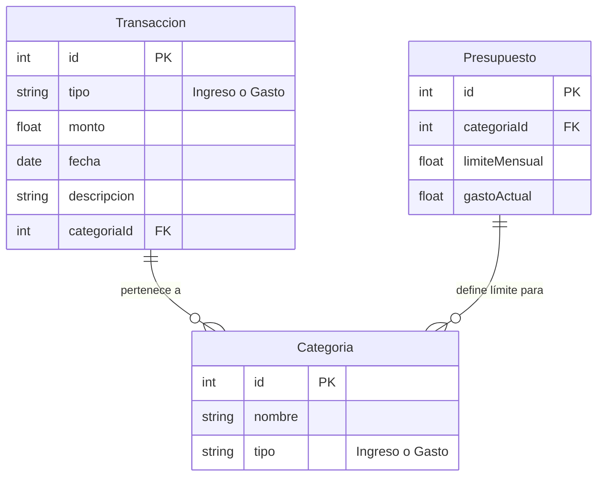

# Finanzas Personales

Este es mi proyecto final de la asignatura Plataformas Software Móviles de Android desarrollado en Kotlin usando la libreria Jetpack Compose, diseñado para ayudarte a gestionar tus finanzas personales de manera eficiente.

## Características principales
- **Gestión de ingresos y gastos:** Registra tus transacciones diarias.
- **Informes detallados:** Visualiza gráficos y estadísticas de tus finanzas.
- **Categorías personalizables:** Clasifica tus ingresos y gastos según tus necesidades.
- **Presupuestos:** Establece presupuestos para administrar el gasto por categoría, mes y año.

## **Base de datos local con Room**

### Tablas/Entidades que contiene la Base de Datos:

1. **Tabla de transacciones:**
    - `id`: ID único.
    - `tipo`: "Ingreso" o "Gasto".
    - `monto`: Cantidad de dinero.
    - `categoría`: Relación con la tabla de categorías.
    - `fecha`: Fecha de la transacción.
    - `descripción`: Detalle opcional.
2. **Tabla de categorías:**
    - `id`: ID único.
    - `nombre`: Nombre de la categoría (Comida, Transporte, etc.).
    - `tipo`: "Ingreso" o "Gasto" (para limitar qué categorías se muestran según el tipo de transacción).
3. **Tabla de presupuestos:**
    - `id`: ID único.
    - `categoría`: Relación con la tabla de categorías.
    - `límite_mensual`: Presupuesto asignado para la categoría.
    - `gasto_actual`: Gastos acumulados en la categoría este mes.

### Diagrama Entidad-Relación de la Base de Datos



## Estructura del proyecto

```
PlanificadorFinanciero/
├── app/                   # Módulo principal de la aplicación.
├── .gradle/               # Archivos generados por Gradle.
├── .idea/                 # Configuración del proyecto para Android Studio.
├── build.gradle.kts       # Configuración principal de Gradle.
├── gradle/                # Scripts y configuraciones de Gradle.
├── gradlew, gradlew.bat   # Wrappers para Gradle.
├── local.properties       # Configuración local específica.
├── settings.gradle.kts    # Configuración de los módulos del proyecto.
```

## Requisitos previos

- **Android Studio Koala o superior**.
- **JDK 11 o superior**.
- Gradle 8.0 o superior.

## Configuración

1. Clona este repositorio:
   ```bash
   git clone <URL-del-repositorio>
   ```
2. Abre el proyecto en Android Studio.
3. Sincroniza Gradle para descargar las dependencias necesarias.

## Ejecución

1. Conecta un dispositivo Android o utiliza un emulador.
2. Selecciona el módulo `app` como configuración de ejecución.
3. Haz clic en el botón "Run" en Android Studio.

## Tecnologías utilizadas

- **Kotlin:** Lenguaje principal del desarrollo.
- **Jetpack Components:** LiveData, ViewModel, Room, y más.
- **Material Design:** Interfaz moderna y accesible.
- **Gradle KTS:** Configuración del sistema de construcción en Kotlin.

## Contribuciones

¡Las contribuciones son bienvenidas! Por favor, sigue los pasos:

1. Haz un fork del proyecto.
2. Crea una rama nueva:
   ```bash
   git checkout -b feature/nueva-funcionalidad
   ```
3. Realiza tus cambios y haz un commit:
   ```bash
   git commit -m "Añadida nueva funcionalidad"
   ```
4. Sube tus cambios al repositorio remoto:
   ```bash
   git push origin feature/nueva-funcionalidad
   ```
5. Crea un Pull Request.

## Licencia

Este proyecto está bajo la Licencia MIT. Consulta el archivo `LICENSE` para más detalles.
